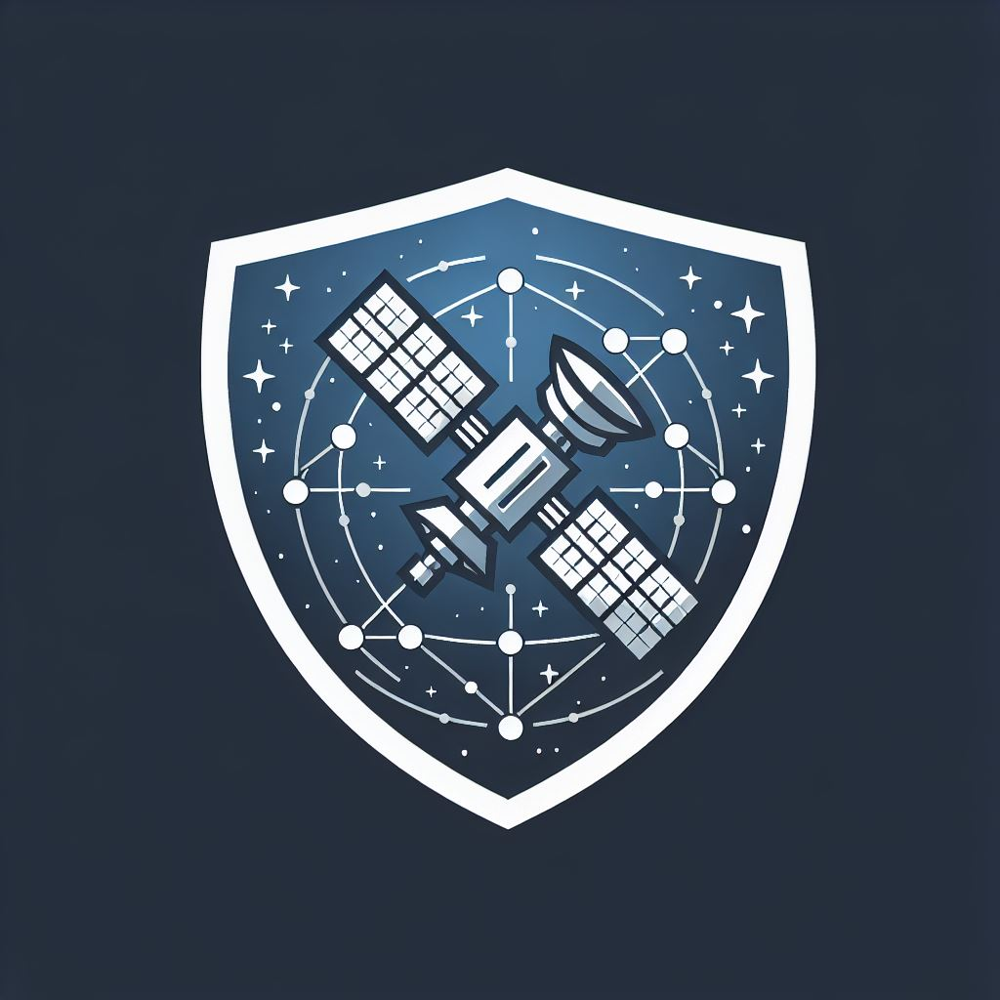
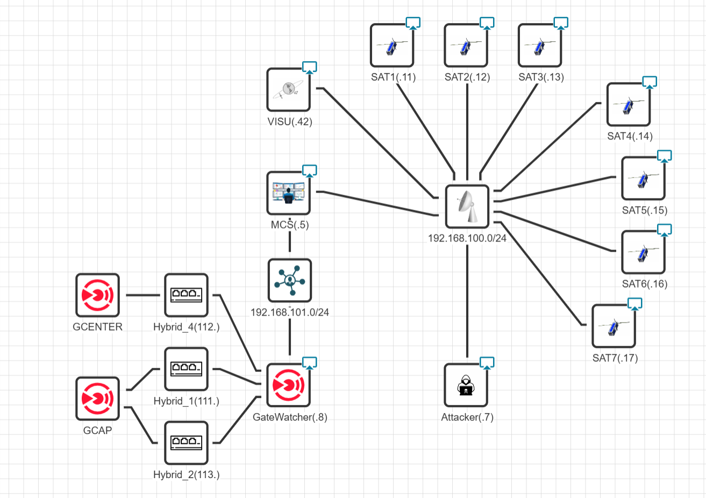
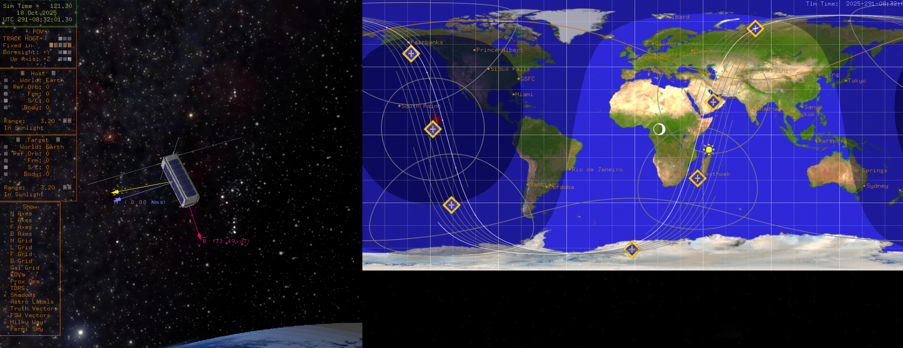

<!-- Improved compatibility of back to top link: See: https://github.com/othneildrew/Best-README-Template/pull/73 -->
<a id="readme-top"></a>
<!--
*** Thanks for checking out the Best-README-Template. If you have a suggestion
*** that would make this better, please fork the repo and create a pull request
*** or simply open an issue with the tag "enhancement".
*** Don't forget to give the project a star!
*** Thanks again! Now go create something AMAZING! :D
-->

<!-- PROJECT SHIELDS -->
<!--
*** I'm using markdown "reference style" links for readability.
*** Reference links are enclosed in brackets [ ] instead of parentheses ( ).
*** See the bottom of this document for the declaration of the reference variables
*** for contributors-url, forks-url, etc. This is an optional, concise syntax you may use.
*** https://www.markdownguide.org/basic-syntax/#reference-style-links
-->
<!--[![Contributors][contributors-shield]][contributors-url]
[![Forks][forks-shield]][forks-url]
[![Stargazers][stars-shield]][stars-url]
[![Issues][issues-shield]][issues-url]
[![MIT License][license-shield]][license-url]
[![LinkedIn][linkedin-shield]][linkedin-url]-->


<!-- PROJECT LOGO -->
<br />
<div align="center">
  <a href="https://github.com/IRT-Saint-Exupery/CSS-Simulator">
    
  </a>

<h3 align="center">CSS Project</h3>

  <p align="center">
    Cybersecurity for Space Systems (CSS)
  </p>
</div>


<!-- TABLE OF CONTENTS -->
<details>
  <summary>Table of Contents</summary>
  <ol>
    <li>
      <a href="#about-the-project">About The Project</a>
      <ul>
        <li><a href="#built-with">Built With</a></li>
      </ul>
    </li>
    <li>
      <a href="#getting-started">Getting Started</a>
      <ul>
        <li><a href="#prerequisites">Prerequisites</a></li>
        <li><a href="#installation">Installation</a></li>
      </ul>
    </li>
    <li><a href="#usage">Usage</a></li>
    <li><a href="#publications">Publications</a></li>
    <li><a href="#license">License</a></li>
    <li><a href="#disclaimer">Disclaimer</a></li>
    <li><a href="#acknowledgments">Acknowledgments</a></li>
  </ol>
</details>


<!-- ABOUT THE PROJECT -->
## About The Project

CSS project (2023 - 2026) is led by the French Institute for Technological Research ([IRT](https://www.irt-saintexupery.com/)) in Toulouse. One of the goal of CSS project is to build a state-of-the-art Space System Simulation platform for Cybersecurty R&D. The CSS simulator can be used to deploy a constellation of satellites, including Flight Software, Mission Control System, space environment and space link communications (based on CCSDS stack). It also embeds an Intrusion Detection System (IDS) onboard the satellites.

The simulator has been developed based on NASA [NOS3](https://github.com/nasa/nos3/releases/tag/v1_06_02) version 1.6.2. (released 07/08/2023). 

The reference space system used in the simulator (with some modifications) is [STF-1](https://www.nasa.gov/simulation-to-flight-1/) mission. 

NASA NOS3 simulator gathers multiple open source projects such as
- [NASA CFS](https://github.com/nasa/cFS) (Flight Software)
- [COSMOS](https://github.com/OpenC3/cosmos) (Mission Control System)
- [NASA 42](https://github.com/ericstoneking/42) (Flight dynamics and visualization)
- [CryptoLib](https://github.com/nasa/CryptoLib) (SDLS)

To create a single multi-purpose, modular and highly customizable space system simulator (see [NOS3](https://github.com/nasa/nos3)).

In the context of CSS project, it has been decided to split the simulator on multiple VM, in order to increase the modularity and to have the possibility to have different operators on different VMs. In particular, it has been chosen to use
- 1 VM for each satellite (NASA CFS).
- 1 VM for the Mission Control System (MCS, ground segment based on COSMOS).
- 1 VM for the flight dynamics and visualization part (NASA 42).


<div align="center">
  <a href="https://github.com/IRT-Saint-Exupery/CSS-Simulator">
    
  </a>


<div align="left">
  </a>

<div style="text-align: left;">

<!-- GETTING STARTED -->
## Getting Started

Please note that CSS Platform is composed by multiple repositories :

1. [*Install_tools_nos3*](/Install_tools_nos3): this is to deploy a satellite or a constellation and to diffuse updates.
2. [*CSS_Attacks*](/CSS_Attacks): this is the folder containing the exploits developed for CSS project.
3. [*Input_Generator*](/Input_Generator): You can define and automate the TC sent to the constellation.
4. [*Github-nos3*](/Desktop/github-nos3): the modified NOS3 code is here (including [ISL](/Desktop/github-nos3/components/isl) and [IDS](/Desktop/github-nos3/components/ids)).
5. [*FrontEnd*](/eclipse-workspace/frontend): the FrontEnd component code is here. 
6. [*Imager*](/eclipse-workspace/imager): the imager (what the camera can see) component code is here. 
7. [*Mission*](/eclipse-workspace/mission): the automatic mission component code is here. 
8. [*Scenario_Manager*](/Scenario_Manager): this is to launch one or several simulations and save the data. For automatic data generation the recommended method is via [*css-dataset*](https://github.com/IRT-Saint-Exupery/css-dataset). 
9. */opt/nos3/*: NASA 42 and COSMOS are installed here in the VM. Cosmos folders are duplicated for each satellite in the constellation (cosmos1, cosmos2, etc).
10. [*css-dataset*](https://github.com/IRT-Saint-Exupery/css-dataset): the code for **Large Scale Dataset Generation** is here (separate GitHub repository)[^1].

[^1]: May not be available at this time. Please reach out if you want to know our progress on it.

Limitations:
 
1. The simulator architecture is adapted only for small constellations. 
2. The RF layer is not simulated.

A simple guide for this simulator can be found in [*Doc*](/Doc) folder.

### Prerequisites

The CSS Simulator is based on multiple VMs: 1 VM for the Mission Control System (COSMOS), 1 VM for Flight Dynamics and Visualization (NASA 42), 1 VM for each satellite in the constellation (NASA cFS).

The comfortable resources CPU/RAM(GB) required to run the simulator can be summarized as follow :
1. Satellite VM : 2CPU / 3GB or higher.
2. Visualization VM : 4CPU / 4GB or higher.
3. MCS VM: 1CPU / 4GB for each satellite to be controlled (or higher, 3CPU / 5.5GB is recommended for 1 SAT). 

The VMs should share the same network (for deployment). The VMs are all defined from a generic VM (based on Ubuntu 20.04 LTS, same as NOS3 VM) that can be specialized after creation.

The preferred method to deploy CSS simulator is via the main generic VM of the project (corresponding to the v0.1 repo tag), that you can request here : [VM Link](https://datasets.irt-saintexupery.com/index.php/s/sPegyh2BkkZ8L09).

The CSS simulator has been defined and deployed in a proprietary cyber range environment (**CITEF** by [Nexova](https://www.nexovagroup.eu/en)). 
However, a priori it is possible to deploy and test the simulator locally (or on dedicated hardware) using VirtualBox (as for NOS3), see next section.


### Installation

For deployment and installation, once you have downloaded the main VM, you should create your own scenario using for example **CITEF** or VirtualBox (see CSS Guide in [*Doc*](/Doc) for VirtualBox procedure). For example the following scenario: 

<div align="center">
  <a href="https://github.com/IRT-Saint-Exupery/CSS-Simulator">
    
  </a>

<div align="left">

Once all VMs are launched, you can simply log into the VM representing the first satellite of your constellation (SAT1). It is suggested to perform 

```bash
git pull origin main
```
from the home directory of the VM in order to get the latest version of the code. Now, you can follow the steps described in [README](/Install_tools_nos3/README.md) to setup the simulation. If you are planning to generate a dataset using the simulator, it is recommended to clone the [*css-dataset*](https://github.com/IRT-Saint-Exupery/css-dataset) repository in the home directory of the VM.

  
Here is also an example of CITEF scenario with 7 satellites (including HIL simulation of proprietary ground probes): 

<div align="center">
  <a href="https://github.com/IRT-Saint-Exupery/CSS-Simulator">
    
  </a>
  
<div align="left">

<!-- USAGE EXAMPLES -->

## Usage

To **launch the simulator** just log to the first satellite (ex. *SAT1(.11)*) and use 

```bash
./start.sh
```
in [*Github-nos3*](/Desktop/github-nos3) folder (*./stop.sh* to stop the simulator).

After launch (generally 1 to 2 minutes) : 
1. NOS3 flight software tabs will be available in each SAT VM. 
2. COSMOS GUI will be available in MCS VM. A web tab will be available for each SAT in Firefox. Moreover, the operator will have access to CryptoLib Standalone tabs and FrontEnd tab.
3. CFDP servers tabs will be available in MCS VM and in each VM SAT.
4. Space environment simulation (NASA 42) will be available in VM VISU (see image below).
5. The camera imager (what the Arducam can see) will be available in each SAT (NB: Imager is updated only if SAT is in "Normal Mode"). 

<div align="center">
  <a href="https://github.com/IRT-Saint-Exupery/CSS-Simulator">
    
  </a>

<div align="left">

The **automatic mission** defined in [*Mission*](/eclipse-workspace/mission) component will start a few minutes after starting the simulator. In particular, the targets of the mission are defined in [targets.txt](/eclipse-workspace/mission/config/targets.txt). TO Telemetry, Sensors and Normal mode are activated by TC during the mission.
 
You can test some **attacks** using:

```bash
./Master_Attacks_Scripts.sh <exploit_number>
```

See [*CSS_Attacks*](/CSS_Attacks) folder and CSS guide in [*Doc*](/Doc) for more details. 

A live demonstration of CSS simulation platform has been presented at:

* [CYSAT 2025](https://cysat.eu/cysat-europe)
* [Starion/Nexova Tech Talks](https://youtu.be/7SkSOk2pjhM?feature=shared)


**Notes and Limitations:**
1. IDS/IPS component is active by default, you should modify the script [ids_probes.h](/github-nos3/components/ids/fsw/src/ids_probes.h) to disable the 3 probes and recompile the simulator. The IDS is in mode "prevention" by default once activated. Logs about attacks are dropped in */tmp* folder. 
2. TTL (Time To Leave) information is added by default in front of each TF (1 octet) in order to avoid loops into the constellation network. A counter about dropped packets is available in ISL Telemetry. In order to deactivate TTL check in, one can use *ISL_TTL_FEATURE=0* in *isl_app.h*. Warning: *ISL_TTL_INIT* in ISL and *TTL_INIT* in FrontEnd shall be the same. 
3. A check for new routing tables received by TC is added by default in ISL to avoid loops. Comment *#define ISL_LOOP_CHECK* in *isl_app.h* to deactivate this feature. 
4. A dummy MAC is introduced to identify some Critical TCs as *CFE_ES_STOP_APP* and *GENERIC_ADCS_SET_MODE_CC* (end of SPP packet). One can use the same approach to define other critical TCs.
5. Watchdog messages are exchanged among the satellites via the ISL (as TM messages). 
6. CFDP layer is based on external python library [here](https://gitlab.com/librecube/lib/python-cfdp). See *CF_UPLINK_FILE* / *CF_DOWNLINK_FILE* commands.
7. The ground stations used for visibility computation are in *Inp_Sim.txt*. 
8. The simulator consider a simple dynamic routing algorithm by default (simple ring topology with 1 feeder link).

More information can be found in the simulator guide in [*Doc*](/Doc) folder. 

**Development**
1. The simulator development can be managed completely from SAT1 VM. We suggest to modify only SAT1 and then to diffuse the modifications. This is managed via bash scripts in [*Install_tools_nos3*](/Install_tools_nos3) folder, see [README](/Install_tools_nos3/README.md).

<!-- PUBLICATIONS EXAMPLES -->
## Publications

* [ESA 3S 2025](https://indico.esa.int/event/571/attachments/7211/13615/A%20Satellite%20Constellation%20Simulator%20for%20Space.pdf): A satellite constellation simulator for space systems cybersecurity research and development. (Introduction)
* [IAC 2025](https://dl.iafastro.directory/event/IAC-2025/paper/96166/): A novel simulation platform for space systems cybersecurity R&D. (Focused on attacks and mitigations)
* [EDCC 2026](https://www.cs.kent.ac.uk/EDCC2026/home): Attack Scenarios and Embedded Intrusion Detection for Space Systems.

If you find this work useful, please acknowledge it by citing these papers.

<!-- LICENSE -->
## License
NOS3 is distributed under the NOSA 1.3 License that can be found in github-nos3 folder. 
The CSS simulator is also distributed under the NOSA 1.3 License. See `LICENSE.txt` for more information. 

<!-- DISCLAIMER -->
## DISCLAIMER
The provided content is for research and testing. We are not responsible for any inappropriate usage of this content. 
The code and the main VM are provided as-is for general use. We do not offer dedicated support or troubleshooting assistance.

<!-- Contributors -->
## Contributors
The people who contributed to this project are @[Simon9050](https://github.com/Simon9050), @[ItzOren](https://github.com/ItzOren), @[girardja](https://github.com/girardja) and @[lucashervier](https://github.com/lucashervier).

<!-- ACKNOWLEDGMENTS -->
## Acknowledgments

* [NASA](https://www.nasa.gov/jon-mcbride-software-testing-and-research-jstar/) for sharing NOS3 simulator with the community.
* [IRT](https://www.irt-saintexupery.com/) for driving and supporting the project.
* [STARION](https://www.stariongroup.eu/) and [NEXOVA](https://www.nexovagroup.eu/) for driving the development and providing access to CITEF platform. 
* [Thales Alenia Space](https://www.thalesaleniaspace.com/fr) for driving and supporting the development.
* [LAAS-CNRS](https://www.laas.fr/en/) for the scientific and technical contribution.
* [Gatewatcher](https://www.gatewatcher.com/) for the support and access to ground probes.
* [French Air Force Academy](https://www.ecole-air-espace.fr/) for the institutional and scientific support.
* [CNES](https://cnes.fr/) for the institutional and scientific support.


</div>
